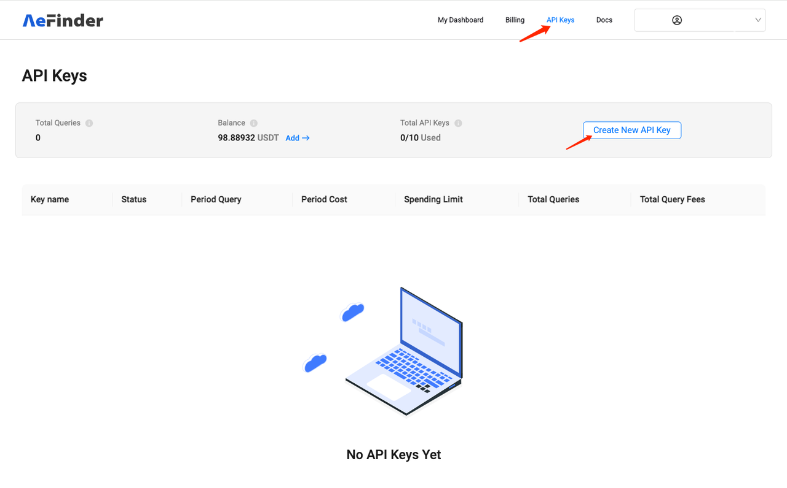
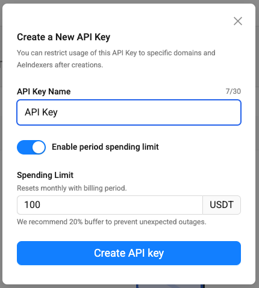
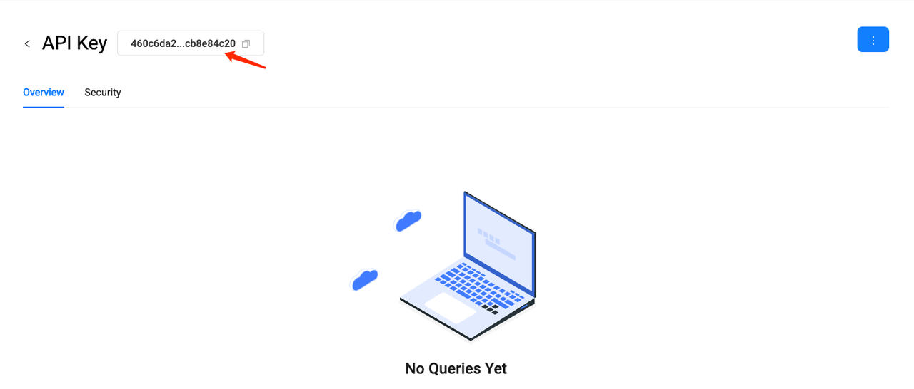
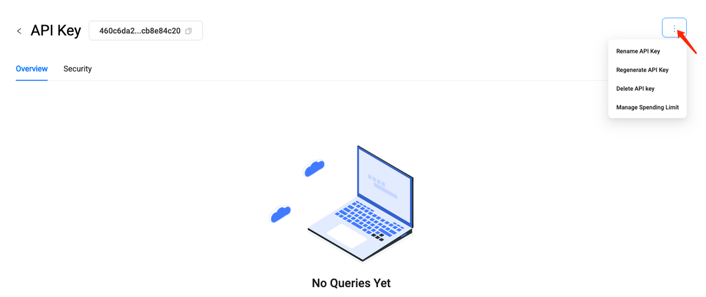

# Querying
When AeIndexer is successfully deployed to the AeFinder network, you can query data through the AeIndexer details page. At the same time, you can query data through the unique URL of each AeIndexer in your application. The query URL format is as follows:
```
https://indexer-api.aefinder.io/api/{API_KEY}/graphql/{APP_ID} 
```
The request is a **POST** request.

API Keys must be used in the query URL. You can learn how to create and manage API KEY in API Keys Management.
AeFinder provides each user with 100,000 free queries per month. If the number of free queries is insufficient, you can purchase more by paying USDT. You can learn more about purchasing API Query [here](resource-charge.md).

## API Keys Management
### Create API Key
On the API Keys page, you can create your API Key. Each account can have up to 10 API Keys.



When creating an API Key, you can also set a monthly usage limit. Once the limit is exceeded, the API Key will stop being used.



After the creation is successful, you can see the Key on the details page. Put this key in the query URL to start your query.



### Manage API Keys
On the API Keys details page, you can manage the Key:
- Edit API Key name.
- Regenerate Key.
- Delete API Key.
- Set monthly usage limits.



### API Keys security settings
On the API Keys details page, you can set authorization for the API Key:

- Set the AeIndexer that can be queried.
- Set accessible Domains.
- Set AeFinder APIs that can be queried

