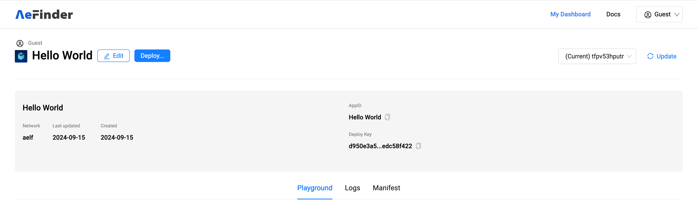
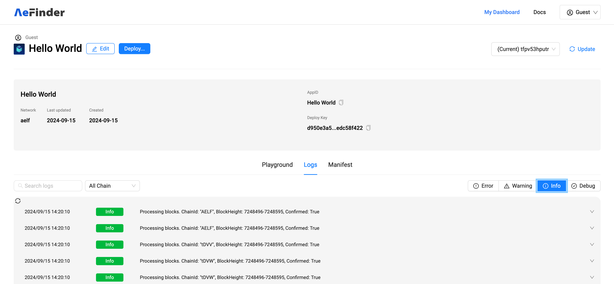

# Quick Start

## 1. Create an App in AeFinder
   - Log in to AeFinder and create your own AeFinder App.
   - **AeFinder System Web URL**
     - MainNet: [https://www.aefinder.io](https://www.aefinder.io)
     - TestNet: [https://test.aefinder.io](https://test.aefinder.io)
   - Open the website, click on "Dashboard" in the top right corner to enter the AeFinder App management backend.
     
   - **User name and password**
     - Please contact the system administrator to obtain the username and password.
   - After logging in, click the "Create app" button on the top right corner to create an App.
     
   - In the panel that appears on the right, enter the name of the App.
     - **Note:** The App name can only consist of letters, numbers, and spaces, and the total length must not exceed 20 characters.

     
   - After successful creation, the corresponding AppId that was synchronously created will be displayed. This AppId is important for future references and integrations.

     
   - You can proceed to add other detailed information about the App.
   - Alternatively, you can choose not to add any additional information and simply save. This completes the creation of the App.
     
   - Click on the card to enter the App details page for more operations.

## 2. Develop AeFinder App

### Install the Local Development Environment

- **Environment Requirement**: Currently, AeFinder App only supports development using the C# language.
- **Required Installation**: You will need to install the .NET 8.0 SDK locally. Visit the [official .NET download page](https://dotnet.microsoft.com/en-us/download/dotnet/8.0) to get the SDK.

### Create and Download the AeFinder App Template

- Go to the details page of the App you created.
- Fill in the project name for the App you want to develop according to the specifications, and then click to download.
  

### Set up the Development Project

- **Extract Project Files**:
  - Once the download is complete, you will have a zip file. Unzip it to proceed.
  - After unzipping, you will find the `.sln` project file for C# development.
- **Project Development**:
  - Open the `.sln` file with your IDE to start developing your AeFinder App.

### Development Tips

- After creating an App through AeFinder, you can download your AeFinder App development project.
- **IDE Recommendation**: Complete the development using the IDE you are familiar with. For more detailed instructions on how to develop an AeFinder App, please refer to the development section of the documentation or online resources.

## 3. Deploy AeFinder App

### Steps to Deploy Your App

1. **Initiate Deployment**
   - Once your AeFinder App development is complete, log in to the AeFinder system.
   - Navigate to the App details page.
   - Click the "Deploy" button located in the top left corner to begin the deployment process.
     

2. **Set Up Subscription Information**
   - Fill in the subscription information in JSON format. This includes specifying details such as `ChainId`, `StartBlockNumber`, `Transactions`, and `LogEvents`.
   - Upload the `.dll` file of your AeFinder App.
     

### Example of Subscription Information JSON

```json
{
    "SubscriptionItems": [
        {
            "ChainId": "AELF",
            "StartBlockNumber": 225599981,
            "OnlyConfirmed": false,
            "Transactions": [
                {
                    "To": "JRmBduh4nXWi1aXgdUsj5gJrzeZb2LxmrAbf7W99faZSvoAaE",
                    "MethodNames": ["Create", "Approve"]
                }
            ],
            "LogEvents": [
                {
                    "ContractAddress": "JRmBduh4nXWi1aXgdUsj5gJrzeZb2LxmrAbf7W99faZSvoAaE",
                    "EventNames": ["Transferred"]
                },
                {
                    "ContractAddress": "2LUmicHyH4RXrMjG4beDwuDsiWJESyLkgkwPdGTR8kahRzq5XS",
                    "EventNames": ["SetSomeInput"]
                }
            ]
        },
        {
            "ChainId": "tDVV",
            "StartBlockNumber": 124424409,
            "OnlyConfirmed": false,
            "Transactions": [
                {
                    "To": "7RzVGiuVWkvL4VfVHdZfQF2Tri3sgLe9U991bohHFfSRZXuGX",
                    "MethodNames": ["Create"]
                }
            ],
            "LogEvents": [
                {
                    "ContractAddress": "7RzVGiuVWkvL4VfVHdZfQF2Tri3sgLe9U991bohHFfSRZXuGX",
                    "EventNames": ["Transferred"]
                }
            ]
        }
    ]
}
```

- After confirming that the subscription information and the .dll file are correct, click the "Deploy" button to complete the deployment.

## 4. Test AeFinder App

### Testing and Troubleshooting

1. **Access the Playground**
   - After a successful deployment, navigate back to the App details page.
   - Locate the Playground panel where you can enter GraphQL query statements to interact with the App interface.
     

2. **Check Subscription Version**
   - In the Playground panel, use the dropdown menu located at the top right corner to view the current subscription version number of the App.
     

3. **View Logs**
   - Click on the "Logs" tab below the Playground panel to switch to the log panel.
   - Here, you can monitor the logs of your AeFinder App processing blocks and check for any abnormalities.
     

### Tips for Effective Testing

- **Query Correctly**: Ensure your GraphQL queries are well-formed to avoid errors and to properly test the functionalities of your AeFinder App.
- **Monitor Logs**: Regularly check the logs for any unusual activities or errors that could indicate issues with the App's performance or behavior.

### Notes:

- These tools are designed to help you effectively test and refine your application before it goes live.

## 5. Query Data

### Accessing Your AeFinder App Data

To query data from your AeFinder App, you will use specific URLs provided on your AeFinder App's page. These URLs are tailored based on the network environment (MainNet or TestNet) and optionally, the specific version of your App.

### Standard URLs for Querying Data

- **GraphQL URL for TestNet Environment**:
  - `https://gcptest-indexer-api.aefinder.io/api/app/graphql/{AppID}`
  - **Example**: `https://gcptest-indexer-api.aefinder.io/api/app/graphql/hello_world` where `hello_world` is the AppID.

- **GraphQL URL for MainNet**:
  - `https://indexer-api.aefinder.io/api/app/graphql/{AppID}`

### Requesting a Specific Version

If your needs require data from a specific version of your AeFinder App, modify the URL by appending the version ID. Here's how you can structure this URL:

- **URL for Specific Version on TestNet**:
  - `https://gcptest-indexer-api.aefinder.io/api/app/graphql/hello_world/6a7665d7cf1d42a6a1c2354959f6a83a`
  - In this URL:
    - `hello_world` is the AppID.
    - `6a7665d7cf1d42a6a1c2354959f6a83a` represents a specific version of the App.

### Tips for Effective Data Querying

- **Check the URL**: Make sure the URL is correctly formatted with your specific AppID and, if necessary, the version ID.
- **Environment Selection**: Choose the appropriate URL depending on whether you are operating in a test or production environment.

### Note:

- Replace `{AppID}` with your actual AppID when using the URLs provided. This ensures you are querying the correct data source.