# Resource Charges
In the AeFinder, Processor, Storage, and API Query resources are provided for deploying and running AeIndexer and querying the API. Appropriate resources can be purchased according to the project situation.
AeFinder currently supports USDT for payment, please make sure before purchasing resources:
- Successfully connect to the bound wallet when logging in for the first time, supporting Portkey or NightElf wallet.
- There is enough USDT in the aelf dApp chain for resource purchases.

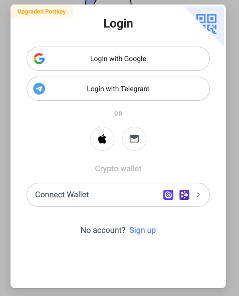
## Pricing
### Free Resource
After successfully registering, users will receive the following free resources:
- Small Processor valid for 7 days.
- 1 GB Storage valid for 7 days.
- 100,000 free API queries per month.
### Processor
We provide three specifications of Processor, which you can choose according to your own situation. The price is as follows:
| Name           | CPU        | Memory         | Price          |
|:--------------:|:----------:|:--------------:|:--------------:|
| **Small**      | 0.5 vCPU   | 1.5 GB         | 0.04 USDT/hr   |
| **Medium**     | 1 vCPU     | 3 GB           | 0.08 USDT/hr   |
| **Large**      | 2 vCPU     | 6 GB           | 0.15 USDT/hr   |

### Storage
Data storage is charged at 0.000695 USDT/hr per GB.
### API Query
After the free API Query is used up each month, it will be charged 1.8 USDT/100,000 times.

***Note: The current prices are promotional and available for a limited time only.***
## Deposit & Withdraw
### Deposit
If you want to purchase resources, you need to deposit the Billing Contract first.
Click the top menu Billing on the DashBoard page to enter the billing management page.

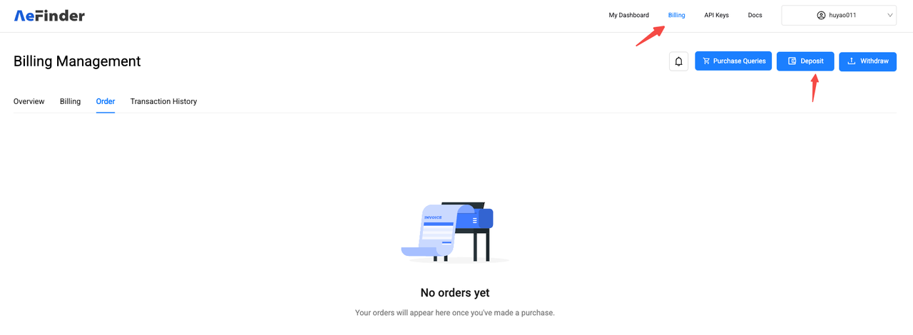
Then click the "Deposit" button to enter the deposit page.

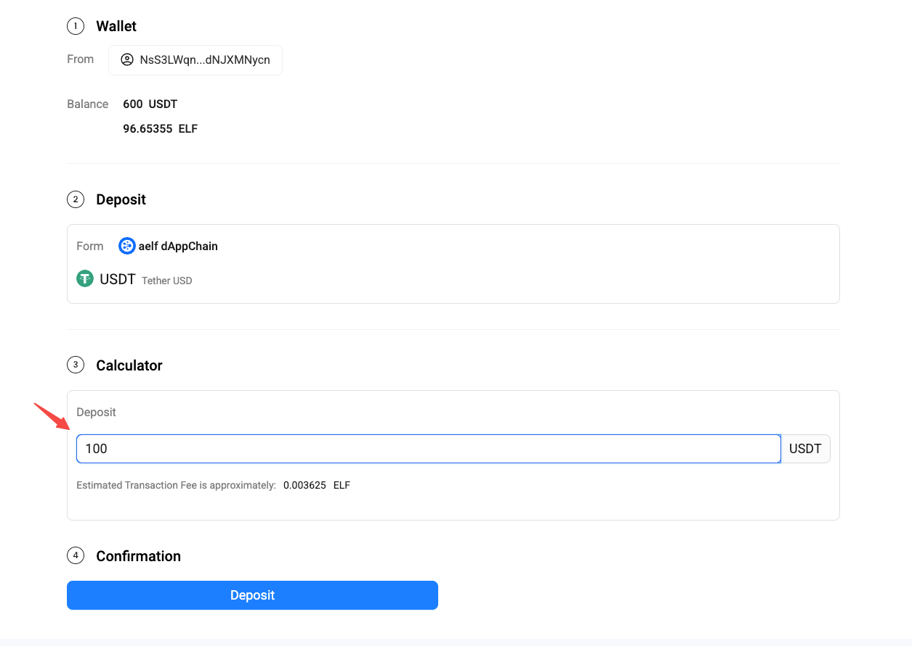
Enter the deposit amount to recharge.
Only the balance deposited into the contract account can be used to purchase subsequent resources.
### Withdraw
For tokens that have been deposited to the Billing Contract, if they are not used to purchase resources, they can be withdrawn to your own wallet at any time through the Withdraw function.

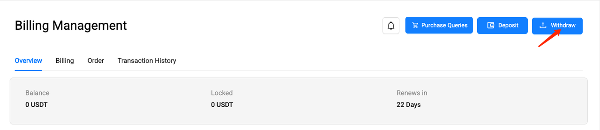

## Purchase the resources required to deploy AeIndexer
If you have developed your own AeIndexer (For development documents, see [Developing](developing.md)), and want it to run smoothly in AeFinder, you need to purchase resources for deploying and running AeIndexer, Processor, and Storage.
- Processor: used to process block data and index.
- Storage: stores data indexed by AeIndexer.

### 1. Create AeIndexer
On the My Dashboard page, click "Create AeIndexer" in the upper right corner to start creating AeIndexer.

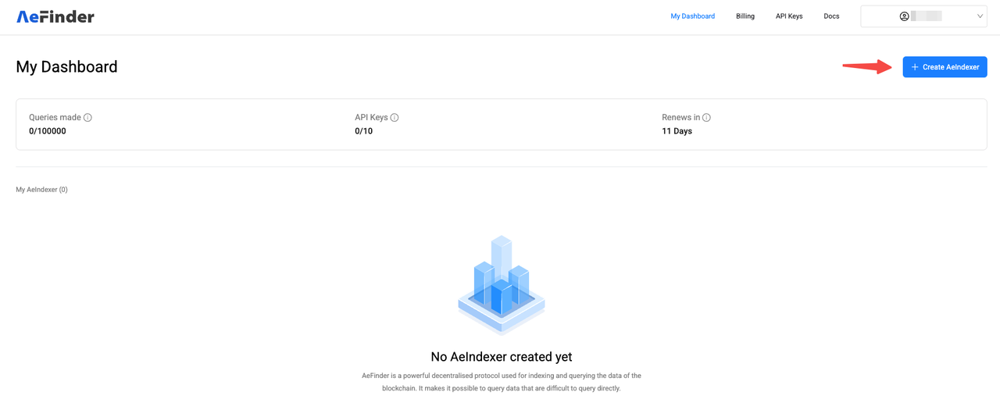

Then, in the pop-up box on the right, enter the AeIndexer name. The AeIndexer name can only consist of letters ('A'-'Z', 'a'-'z'), numbers (0-9), and spaces (' ').

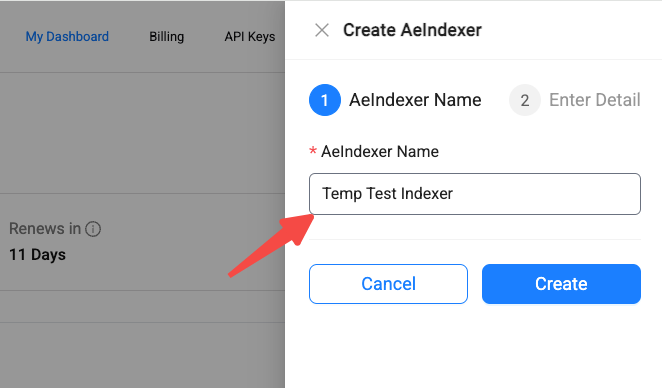

Fill in other relevant information of AeIndexer.

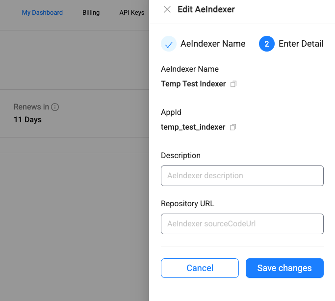

Finally, click "Save" to complete the creation of AeIndexer.

### 2. Select resource specifications
Click on the created AeIndexer to enter the management page.

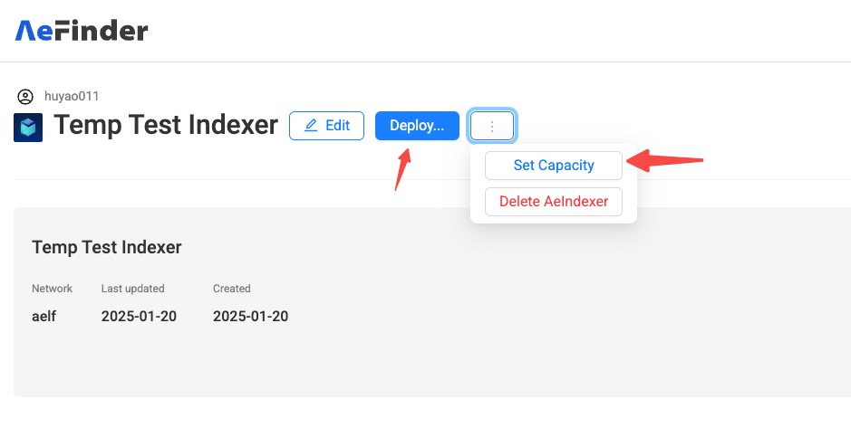

For the first deployment, click "Deploy" or "Set Capacity" to enter the Processor resource purchase page.

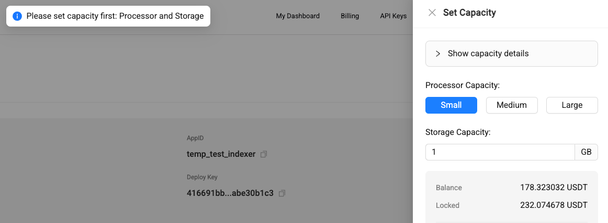

There are several different processor resource specifications to choose from. You can make estimates based on their AeIndexer operation and choose to purchase them as appropriate (the price in the figure below refers to the hourly cost).

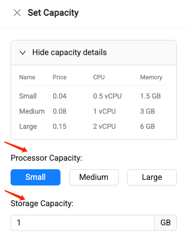

And specify the required Storage resources。
### 3. Place order and pay
After selecting the processor resource specification and setting the required storage resource size, the system will automatically display the estimated cost for the current month based on the specified specifications. Please check carefully.

After verification, click "Save" to place the order.

### 4. Check order
After the order is successfully placed, you will be automatically redirected to the order list page.

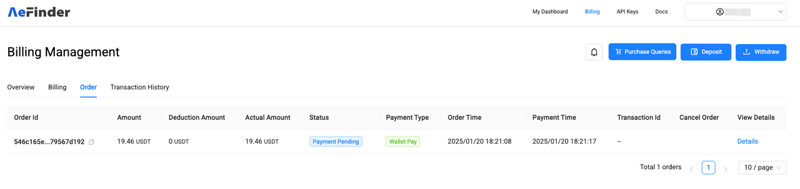

The order status shows "Payment Pending" which means the order transaction is being confirmed and needs to wait for a while (usually about a few minutes).
Click "Detail" to view the order details.

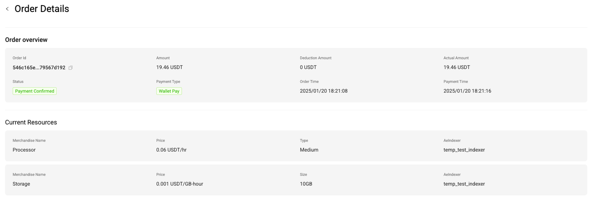

When the order status changes to "Payment Confirmed", it means that the payment for the order is completed and you can start using the purchased resources.

### 5. Deployment
After the order payment is completed, you can return to the AeIndexer management page and click "Deploy" to deploy.

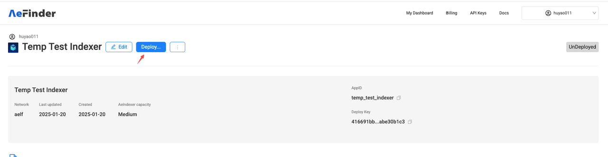

For detailed deployment operations, see [Quick Start](quick-start.md).
## Purchase API Query
Querying AeIndexer or AeFinder APIs will consume API query times. When 100,000 free queries per month are used up, if you want to continue using queries, you need to purchase additional query times.
### 1. Select the number of API queries

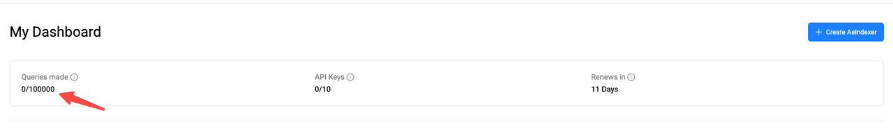

You can go to the "Billing" page in the menu bar and click "Purchase Queries" to purchase more API queries.

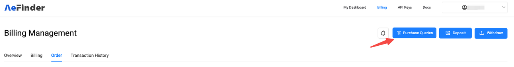

After entering the Purchase Queries page, drag the scroll bar under the "Estimated number of queries" column to select the number of API queries you need, or you can directly enter the desired number in the input box on the right side of the column.

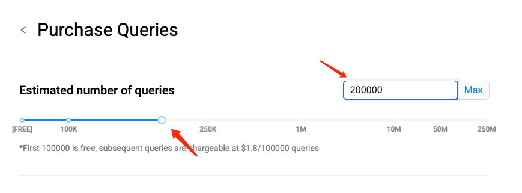

### 2. Place order and pay
After selecting the desired number of monthly API queries, the corresponding order amount will be generated on the right side of the interface. Please check carefully.

After verification, click “Confirm monthly purchase” to place the order.
### 3. Check order
After the order is successfully placed, you will automatically jump to the order list page. (Or click "Billing" in the top menu to enter the billing interface and you can see the order you just created)

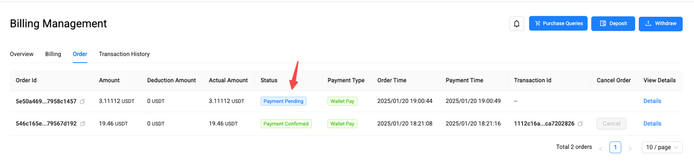

The order status shows "Payment Pending" which means the order transaction is being confirmed and needs to wait for a while (usually about a few minutes).
Click "Detail" to view the order details.

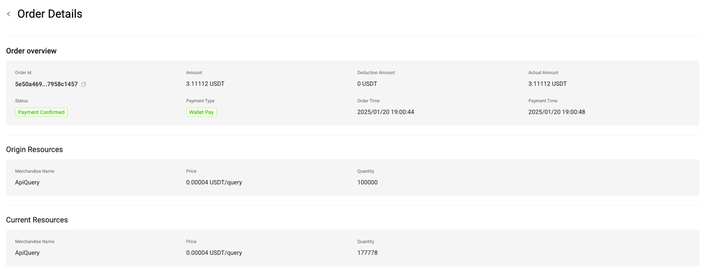

When the order status changes to "Payment Confirmed", it means that the payment for the order is completed and you can start using the purchased resources.

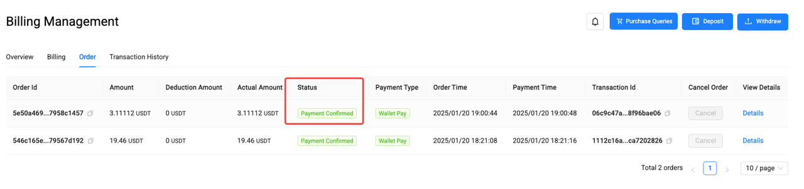

## Billing
At the beginning of each month, the system will generate Settlement Billing and Advance Payment Billing, and automatically deduct the fees. You can see the billing details in Billing Management.
- Settlement Billing: Settle the resources used in the previous month and generate a bill. The actual usage will be deducted from the advance payment, and the remaining amount will be returned to the user's Billing Contract account.
- Advance Payment Billing： The resources that continue to be used this month will be pre-deducted and a billing will be generated. The fees will be deducted by locking the user's Billing Contract balance. If the user's balance is insufficient and the fees cannot be deducted normally, the user account will be frozen after 7 days. At that time, the user's AeIndexer will stop running and the number of API Query will be downgraded to the free package.